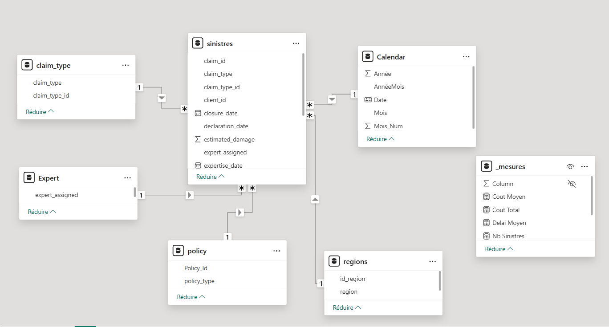
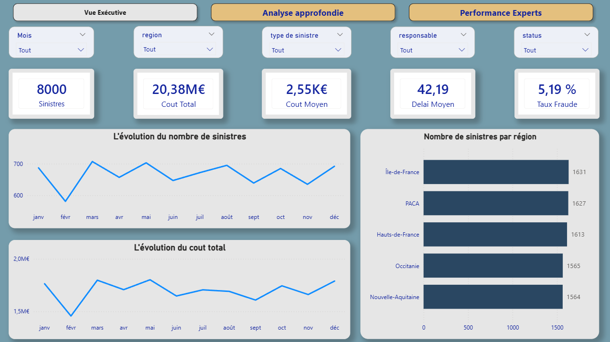
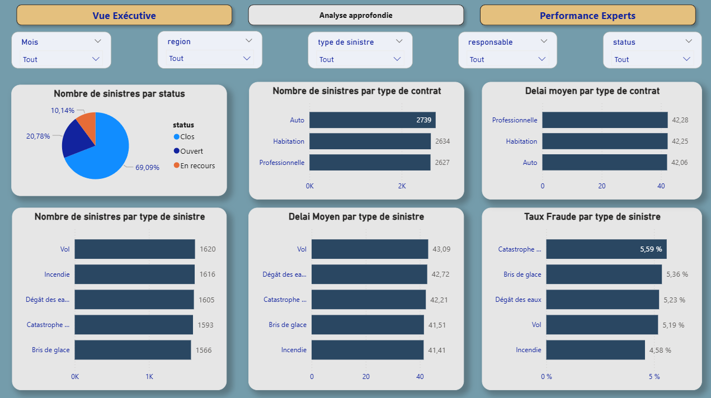
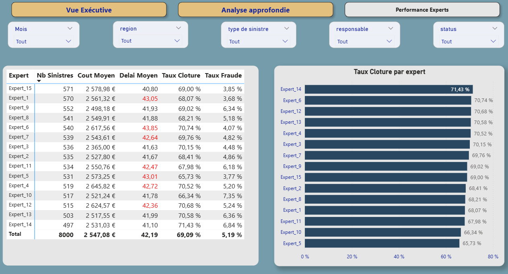

# 📊 Analyse des sinistres d'assurance – Tableau de bord Power BI
## 📌 Aperçu du projet

Ce projet présente un tableau de bord analytique complet, construit avec Power BI, pour analyser la performance des demandes d'indemnisation.

L’objectif est de simuler un environnement d’assurance réel et de fournir des informations opérationnelles et stratégiques sur :

* Volume des réclamations
* performance financière
* Retards de traitement
* Taux de fraude
* Performance experte

Ce projet suit les meilleures pratiques en matière de BI, notamment la modélisation en étoile , l'optimisation des mesures DAX et la conception professionnelle des tableaux de bord.

## 🏢 Contexte commercial

Les compagnies d'assurance et les cabinets d'expertise en sinistres doivent surveiller :

* Répartition de la charge de travail des réclamations
* Temps de traitement moyen
* Contrôle des coûts
* Détection de la fraude
* Efficacité opérationnelle des experts

Ce tableau de bord simule un portefeuille de 8 000 demandes d’indemnisation réparties sur plusieurs régions et types de contrats.

## 📈 Architecture
```
Data Source (CSV)
        ↓
Power Query (Cleaning)
        ↓
Star Schema Model
        ↓
DAX Measures
        ↓
Interactive Dashboard
```
## 📂 Jeu de données

Jeu de données synthétiques généré à l'aide de Python.

**Principales variables** :

* claim_id
* region
* claim_type
* policy_type
* responsable
* declaration_date
* closure_date
* paid_amount
* fraud_flag
* status

Nombre total d'enregistrements : 8 000

## 🏗 Modèle de données

Le modèle suit une architecture en étoile :

**Table de faits**

* Sinistres

**Tables de dimensions**

* Date
* Region
* Claim_Type
* Policy_Type
* Expert

**Relations** :

* Un à plusieurs
* Filtrage unidirectionnel
* Table de calendrier dédiée
* Aucune relation bidirectionnelle



## 📈 Indicateurs clés de performance (KPI)

* Total des sinistres
* Coût total
* Coût moyen
* Délai de traitement moyen
* Taux de fraude
* Taux de fermeture

## Dashboard 

**Vue exécutive**


**analyse approndie**


**performance experts**


L'analyse montre un portefeuille homogène et stable, avec une performance globale correcte. Les principaux leviers d'amélioration concernent 

la réduction du délai moyen et l'optimisation de certains experts dont les performances sont légèrement inférieures à la moyenne

## 🎯Compétences démontrées

* Modélisation des données (schéma en étoile)
* Calculs DAX
* Conception des indicateurs clés de performance (KPI)
* Analyse commerciale
* Conception UX du tableau de bord
* Analyse des performances
